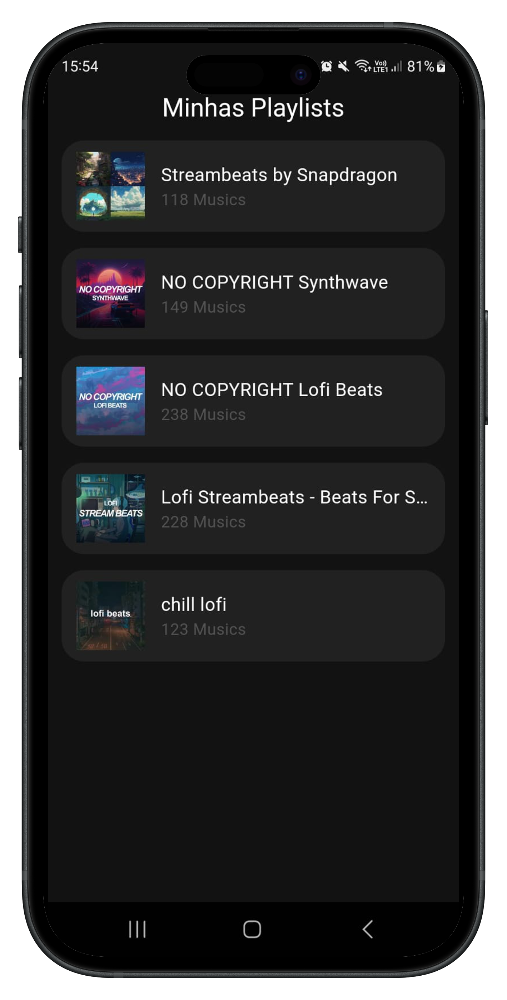
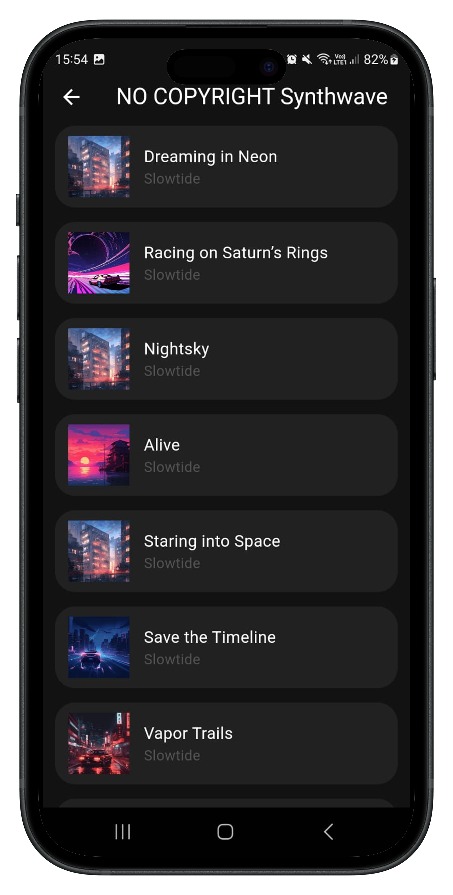
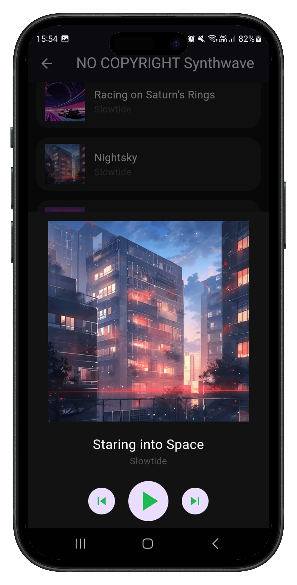

&nbsp;&nbsp;
&nbsp;&nbsp;
&nbsp;&nbsp;


# Hear Fy

## Esse projeto tem como objetivo realizar o consumo de algumas funcionalidades da Api disponibilizada pelo Spotify.

<br>
<p align="center">
  
  
  
</p>

<p align="center">
  <a href="">
    
  </a>
</p>

## Funcionalidades
* Busca das playlists publicas pelo ID de determinado usuário
* Listagem das músicas da playlist
* Reprodução das músicas(Deixei para tocar apenas as prévias de cada música)
* Alternar entre as músicas pelos botões de pular e voltar

## Dependencias
<details>
     <summary> Ler mais </summary>

* [dio](https://pub.dev/packages/dio)
* [get](https://pub.dev/packages/get)
* [loading_animation_widget](https://pub.dev/packages/loading_animation_widget)
* [just_audio](https://pub.dev/packages/just_audio)

    </details>

## Como rodar o projeto

### Versão do Flutter utilizada: 3.16.5
Quando abrir o projeto em sua máquina, se atentar de rodar o comando "flutter pub get" no terminal 

Passo 1: Acessar o link de Desenvolvedor Spotify
https://developer.spotify.com/dashboard

Passo 2: Realizar a criação do App dentro do site do Spotify


Passo 3: Após a criação do App na plataforma, vai ser liberado um Client ID e um Client Secret que vão ser utilizados no consumo da Api


Passo 4: Dentro do projeto, localize o arquivo constants.dart, nele é onde sera incluso o Client_ID e Cliente_Secret quer você acabou de conseguir na plataforma


Passo 5: Já deixei o ID de um usuário aleatório no código do projeto, porém, se voce quiser alterar esse ID e colocar o seu perfil, basta pegar o link da sua conta e copiar essa parte do texto


Para mais informações sobre a api para futuras implementações, segue o link da documentação oficial
- https://developer.spotify.com/documentation/web-api/tutorials/getting-started

## Estrutura de pastas
<details>
     <summary> Click to expand </summary>

```
lib
 ┣ app
 ┃ ┣ core
 ┃ ┃ ┣ bindings
 ┃ ┃ ┃ ┗ application_bindings.dart
 ┃ ┃ ┣ constants
 ┃ ┃ ┃ ┗ constants.dart
 ┃ ┃ ┣ exceptions
 ┃ ┃ ┃ ┣ app_exception.dart
 ┃ ┃ ┃ ┣ app_rate_limits_exception.dart
 ┃ ┃ ┃ ┣ expired_token_exception.dart
 ┃ ┃ ┃ ┗ oauth_incorrect_exception.dart
 ┃ ┃ ┣ mixins
 ┃ ┃ ┃ ┣ loading_mixin.dart
 ┃ ┃ ┃ ┗ messages_mixin.dart
 ┃ ┃ ┣ models
 ┃ ┃ ┃ ┣ playlist
 ┃ ┃ ┃ ┃ ┣ artist_model.dart
 ┃ ┃ ┃ ┃ ┣ playlist_banner_model.dart
 ┃ ┃ ┃ ┃ ┣ playlist_items_model.dart
 ┃ ┃ ┃ ┃ ┣ playlist_model.dart
 ┃ ┃ ┃ ┃ ┣ playlist_tracks_model.dart
 ┃ ┃ ┃ ┃ ┗ playlist_track_model.dart
 ┃ ┃ ┃ ┗ album_model.dart
 ┃ ┃ ┣ rest_client
 ┃ ┃ ┃ ┣ spotify_auth_interceptor.dart
 ┃ ┃ ┃ ┗ spotify_rest_client.dart
 ┃ ┃ ┣ ui
 ┃ ┃ ┃ ┗ app_colors.dart
 ┃ ┃ ┗ util
 ┃ ┃ ┃ ┗ format_util.dart
 ┃ ┣ modules
 ┃ ┃ ┣ home
 ┃ ┃ ┃ ┣ widgets
 ┃ ┃ ┃ ┃ ┗ playlist_item_widget.dart
 ┃ ┃ ┃ ┣ home_bindings.dart
 ┃ ┃ ┃ ┣ home_controller.dart
 ┃ ┃ ┃ ┗ home_page.dart
 ┃ ┃ ┗ track
 ┃ ┃ ┃ ┣ widgets
 ┃ ┃ ┃ ┃ ┣ player_widget.dart
 ┃ ┃ ┃ ┃ ┗ track_item_widget.dart
 ┃ ┃ ┃ ┣ track_bindings.dart
 ┃ ┃ ┃ ┣ track_controller.dart
 ┃ ┃ ┃ ┗ track_page.dart
 ┃ ┣ repositories
 ┃ ┃ ┣ playlist
 ┃ ┃ ┃ ┣ playlist_repository.dart
 ┃ ┃ ┃ ┗ playlist_repository_impl.dart
 ┃ ┃ ┗ tracks
 ┃ ┃ ┃ ┣ tracks_repository.dart
 ┃ ┃ ┃ ┗ tracks_repository_impl.dart
 ┃ ┣ routes
 ┃ ┃ ┣ home_routers.dart
 ┃ ┃ ┗ track_routers.dart
 ┃ ┗ services
 ┃ ┃ ┗ tracks
 ┃ ┃ ┃ ┣ track_service.dart
 ┃ ┃ ┃ ┗ track_service_impl.dart
 ┗ main.dart
```

</details>