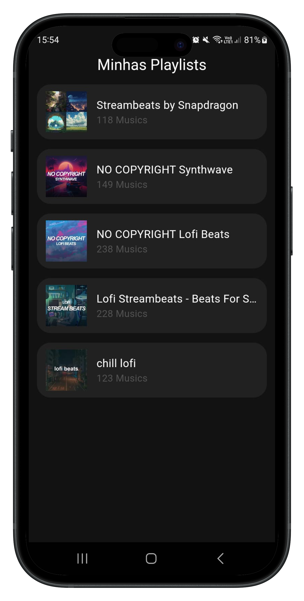
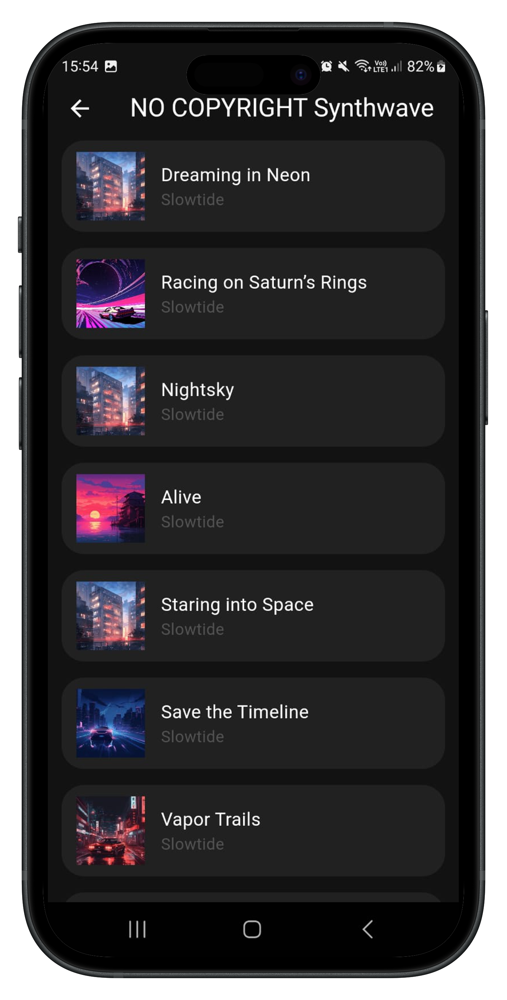
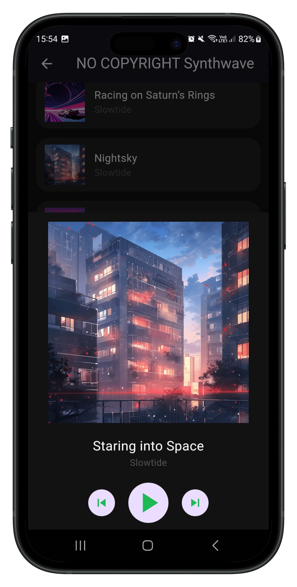

&nbsp;&nbsp;
&nbsp;&nbsp;
&nbsp;&nbsp;


# Hear Fy

## This project aims to consume some features from the API provided by Spotify.

<br>
<p align="center">
  
  
  
</p>

<p align="center">
  <a href="">
    
  </a>
</p>

## Features
* Fetch public playlists by a specific user's ID
* List tracks from a playlist
* Play tracks (set to play only the preview of each track)
* Skip and go back between tracks using navigation buttons

## Dependencies
<details>
     <summary> Read more </summary>

* [dio](https://pub.dev/packages/dio)
* [get](https://pub.dev/packages/get)
* [loading_animation_widget](https://pub.dev/packages/loading_animation_widget)
* [just_audio](https://pub.dev/packages/just_audio)

    </details>

## How to run the project

### Flutter version used: 3.16.5
When opening the project on your machine, make sure to run `flutter pub get` in the terminal.

Step 1: Go to the Spotify Developer Dashboard
https://developer.spotify.com/dashboard

Step 2: Create an App on the Spotify platform


Step 3: After creating the App, a Client ID and a Client Secret will be generated — these are required to consume the API


Step 4: Inside the project, locate the `constants.dart` file — this is where you will insert the Client ID and Client Secret obtained from the platform


Step 5: A random user ID is already included in the project code. However, if you want to use your own profile, just grab the link to your Spotify account and copy this portion of the URL


For more information about the API and future implementations, check the official documentation:
- https://developer.spotify.com/documentation/web-api/tutorials/getting-started

## Folder Structure
<details>
     <summary> Click to expand </summary>

```
lib
 ┣ app
 ┃ ┣ core
 ┃ ┃ ┣ bindings
 ┃ ┃ ┃ ┗ application_bindings.dart
 ┃ ┃ ┣ constants
 ┃ ┃ ┃ ┗ constants.dart
 ┃ ┃ ┣ exceptions
 ┃ ┃ ┃ ┣ app_exception.dart
 ┃ ┃ ┃ ┣ app_rate_limits_exception.dart
 ┃ ┃ ┃ ┣ expired_token_exception.dart
 ┃ ┃ ┃ ┗ oauth_incorrect_exception.dart
 ┃ ┃ ┣ mixins
 ┃ ┃ ┃ ┣ loading_mixin.dart
 ┃ ┃ ┃ ┗ messages_mixin.dart
 ┃ ┃ ┣ models
 ┃ ┃ ┃ ┣ playlist
 ┃ ┃ ┃ ┃ ┣ artist_model.dart
 ┃ ┃ ┃ ┃ ┣ playlist_banner_model.dart
 ┃ ┃ ┃ ┃ ┣ playlist_items_model.dart
 ┃ ┃ ┃ ┃ ┣ playlist_model.dart
 ┃ ┃ ┃ ┃ ┣ playlist_tracks_model.dart
 ┃ ┃ ┃ ┃ ┗ playlist_track_model.dart
 ┃ ┃ ┃ ┗ album_model.dart
 ┃ ┃ ┣ rest_client
 ┃ ┃ ┃ ┣ spotify_auth_interceptor.dart
 ┃ ┃ ┃ ┗ spotify_rest_client.dart
 ┃ ┃ ┣ ui
 ┃ ┃ ┃ ┗ app_colors.dart
 ┃ ┃ ┗ util
 ┃ ┃ ┃ ┗ format_util.dart
 ┃ ┣ modules
 ┃ ┃ ┣ home
 ┃ ┃ ┃ ┣ widgets
 ┃ ┃ ┃ ┃ ┗ playlist_item_widget.dart
 ┃ ┃ ┃ ┣ home_bindings.dart
 ┃ ┃ ┃ ┣ home_controller.dart
 ┃ ┃ ┃ ┗ home_page.dart
 ┃ ┃ ┗ track
 ┃ ┃ ┃ ┣ widgets
 ┃ ┃ ┃ ┃ ┣ player_widget.dart
 ┃ ┃ ┃ ┃ ┗ track_item_widget.dart
 ┃ ┃ ┃ ┣ track_bindings.dart
 ┃ ┃ ┃ ┣ track_controller.dart
 ┃ ┃ ┃ ┗ track_page.dart
 ┃ ┣ repositories
 ┃ ┃ ┣ playlist
 ┃ ┃ ┃ ┣ playlist_repository.dart
 ┃ ┃ ┃ ┗ playlist_repository_impl.dart
 ┃ ┃ ┗ tracks
 ┃ ┃ ┃ ┣ tracks_repository.dart
 ┃ ┃ ┃ ┗ tracks_repository_impl.dart
 ┃ ┣ routes
 ┃ ┃ ┣ home_routers.dart
 ┃ ┃ ┗ track_routers.dart
 ┃ ┗ services
 ┃ ┃ ┗ tracks
 ┃ ┃ ┃ ┣ track_service.dart
 ┃ ┃ ┃ ┗ track_service_impl.dart
 ┗ main.dart
```

</details>
